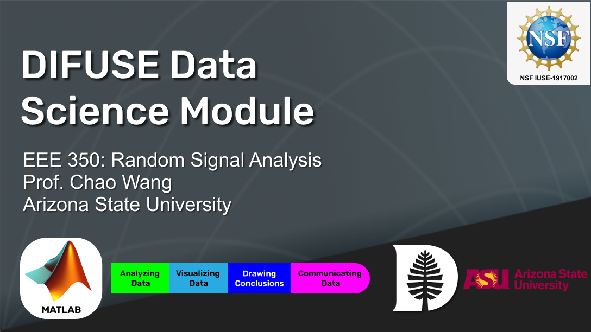

# Engineering: Using Statistics and Supervised Machine Learning to Inform Airline Decision Making

## Contributors: Joe Gyorda (G'24), Ben Levesque ('24), Chao Wang (Professor of Engineering, Arizona State University), Scott Pauls (DIFUSE PI, Professor of Mathematics), and Laura Ray (DIFUSE PI, Professor of Engineering), Taylor Hickey ('23, Project Manager)

This module was developed through the DIFUSE project at Dartmouth College and funded by the National Science Foundation award IUSE-1917002.

| | <a rel="license" href="http://creativecommons.org/licenses/by-sa/4.0/"> </a>This work is licensed under a <a rel="license" href="http://creativecommons.org/licenses/by-sa/4.0/">Creative Commons Attribution-ShareAlike 4.0 International License</a>. |
|---------|----------|

# Module Overview
## Module Objective 
The primary objective for this module is to reinforce the statistical concepts introduced in class through the process of building a data analysis pipeline. Statistical concepts are first implemented to gain an understanding of the data, and this understanding is then used to implement machine learning models. The module is split into two assignments: the first part has students work with the dataset to gain insight into its variables and underlying relationships (exploratory data analysis), and the second part has students implement supervised machine learning models to generate predictions that may inform the decision making of airlines. The machine learning assignment provides additional introductions to the underlying concepts and focuses on interpreting the results rather than coding the models by providing function wrappers to expedite the process.

## Student Learning Objectives
1. Apply the methods of exploratory data analysis and draw conclusions about the relationships in the data.
2. Differentiate between between regression and classification and the conclusions that can be drawn from each.
3. Create and interpret data visualizations to evaluate models and answer questions.
4. Apply these concepts and techniques to a real-world dataset, interpret and effectively communicate the results.

## Module Description
The module focuses on airline data and applications to decision making in the airline industry. In the first part of the module, students engage in exploratory data analysis using univariate and bivariate analyses to generate hypotheses about factors that contribute to flight delays. In the second part, students assume the role of a consultant employed by Phoenix Sky Harbor airport to investigate the role of delays in the performance of airlines. At the end of Part 2, students make an informed recommendation for Sky Harbor based on the output of various machine learning models they implement. 

### Data
The module uses airline data concerning flight delays and their causes.

### Platform
The module uses MATLAB livescripts.

## Schedule and Links

Use this page to get an idea of the timeline of the module, what components are involved, and what documents are related to each component. This is the schedule intended for module deployment by the DIFUSE team, though instructors are welcome to modify the timeline to fit their course environment.

| Date | In/Out of Class | Assignment Description                                                                            | Assignment Files (Linked to Repository Contents) |
|---------------|-----------------|---------------------------------------------------------------------------------------------------|--------------------------------------------------|
|1             | In-class        | Introduce Module, have students start Part 1 MATLAB activity, complete for homework | [Part 1, Statistical Measures](https://github.com/difuse-dartmouth/engineering-airline-analysis/completed_module/components/part%201)                                                 |
|1+            | Out of class    | Students are expected to collaborate in groups to develop a presentation that will be uploaded to Canvas. |   [Canvas Quiz administered by professor](https://github.com/difuse-dartmouth/engineering-airline-analysis/completed_module/components/part%201/canvas_quiz)                                                |
|2             | In-class        | Introduce Part 2 of Module, have students start Part 2 MATLAB activity in groups of 3-4 | [Part 2, ML Techniques](https://github.com/difuse-dartmouth/engineering-airline-analysis/completed_module/components/part%202)                                                 |
|2+            | Out of class    | Students submit their finished presentation slidedecks from Part 2 to instructor for review. | [Part 2, Sample Presentations](https://github.com/difuse-dartmouth/engineering-airline-analysis/completed_module/sample_work) |

## Course Information
This module was designed a course on ASU's <a href="https://ecee.engineering.asu.edu/wp-content/uploads/sites/29/2020/11/EEE_350.pdf">Random Signal Analysis</a>. The module also assumes students have covered some basic probability (e.g., normal distributions), statistical (e.g., hypothesis testing) concepts in their class, and that students have a basic familiarity with MATLAB.
---

| | <a rel="license" href="http://creativecommons.org/licenses/by-sa/4.0/"> </a>This work is licensed under a <a rel="license" href="http://creativecommons.org/licenses/by-sa/4.0/">Creative Commons Attribution-ShareAlike 4.0 International License</a>. |
|---------|----------|

For instructors and interested parties, the history of this repository (with detailed commits), can be found [here](https://github.com/difuse-dartmouth/engineering-airline-analysis/commits/main/).

